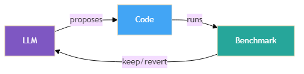
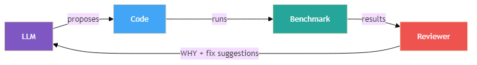
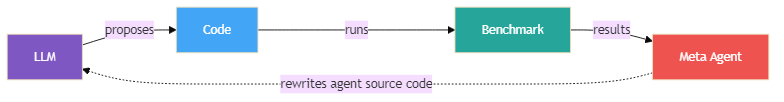
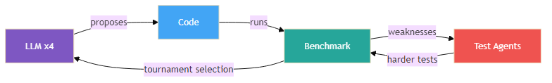

# Self-Improving Agents -- A Progression

Four levels of self-improving code agents, from the simplest loop to a full
adversarial arena with self-modifying agents. Each level adds one key idea.

Independent research comparing existing approaches to self-improving code agents
and proposing new ones.

- **Level 1:** LLM improves code against a benchmark (a la Karpathy's AutoResearch).



- **Level 2:** A reviewer explains WHY it failed and suggests specific fixes (my contribution, built independently in Feb 2026 -- before AutoResearch and HyperAgents were published).



- **Level 3:** The agent rewrites its own source code (inspired by Meta's HyperAgents).



- **Level 4:** The agent rewrites its own code AND the benchmark itself evolves (my proposed next step).



---

## Key Findings

- **Fixed benchmarks create false confidence** -- Levels 1-3 scored 90-100%
  on email validation's original tests, but dropped to 58-62% on Arena Loop's
  adversarial suite. Arena Loop held at 84%. The solutions that looked
  perfect were brittle.
- **LLM-as-judge scores are unreliable without averaging** -- a single judge
  call can swing 30+ points for the same solution. Adding JUDGE_RUNS=3
  (averaging 3 judge calls per evaluation) stabilized scores and let
  HyperAgent climb steadily instead of getting stuck on a noisy ceiling.
- **Feedback Loop is the best value** -- highest score on snake (31.1),
  strong on support, at a fraction of Arena Loop's cost ($0.07 vs $0.40
  per task)
- **Each level has its sweet spot** -- simple tasks need simple agents (Level 1),
  quality tasks need structured feedback (Level 2), and robustness against
  unseen edge cases needs adversarial testing (Level 4)

See [experiment-results.md](experiment-results.md) for full results and
cross-validation data.

---

## Setup

```bash
pip install -r requirements.txt
```

Create a `.env` file in the repo root:

```
GEMINI_API_KEY=your-api-key-from-https://aistudio.google.com/apikey
```

---

## Background & Prior Work

### The Verifiable Rewards Pattern

The core mechanism underlying all four levels is the **verifiable rewards** pattern
from reinforcement learning: an agent takes an action, receives a machine-checkable
reward with no human in the loop, and keeps or discards the result.

This pattern was established by AlphaGo (Silver et al., 2016), where the board rules
themselves verify win/loss -- enabling fully autonomous self-play. It resurfaced in
DeepSeek-R1's RLVR (2025), where math answers are checked against known solutions,
causing reasoning to emerge from the reward signal alone.

Karpathy's AutoResearch (March 2026) applies this same pattern at the agent level:
an LLM proposes code changes, a benchmark metric (`val_bpb`) provides the verifiable
reward, and the loop runs unsupervised overnight. Karpathy himself noted that software
engineering is "infinitely verifiable" (Karpathy, 2025) and identified RLVR as a major
advance -- AutoResearch is the natural synthesis of these two observations, though the
connection was not made explicit in its documentation.

Related work in this space includes Google's AlphaEvolve (May 2025), which uses
population-based evolutionary search with LLMs but fixed evaluators, and Meta's
HyperAgents (March 2026, arxiv 2603.19461), which adds metacognitive self-modification
where the improvement strategy itself is editable.

### Independent Convergence

Autonomous self-improvement loops emerged independently across multiple groups in
early 2026. I implemented a review-based improvement loop for a Graph RAG
system in February 2026, employing asymmetric context windows (small focused worker,
1M-token evaluator) and structured issue taxonomies -- techniques that later appeared
independently in Karpathy's AutoResearch (March 6, 2026) and Meta's HyperAgents
(March 17, 2026). This convergence suggests the pattern was a natural next step given
the capabilities of early-2026 LLMs, rather than a single invention.

### What This Repo Adds

This project presents a **layered progression** from basic verifiable-reward loops to
a full adversarial arena, with each level adding one concept:

1. The loop itself (verifiable rewards at the agent level)
2. Asymmetric structured review (reviewer sees full history, returns categorized feedback)
3. True code-rewriting (meta-agent rewrites its own source code with crash recovery)
4. Adversarial co-evolution with self-modifying agents and population-based tournament

Prior work on adversarial code/test co-evolution (Code-A1, CURE, UTRL, ATGen) operates
through RL weight training -- fine-tuning model parameters. This project takes a
fundamentally different approach: **inference-time strategy evolution with frozen models**,
requiring no training infrastructure. The adversarial dynamic serves as selection pressure
for a population of competing strategies that evolve through tournament selection -- a
genetic algorithm operating in the space of "how to think about improvement," not in
weight space. See `arena-loop/CONCEPT.md` for the full architectural comparison.

---

## Quick Start

```bash
# Run any level (default task: snake)
python autoresearch/run.py
python feedback-loop/run.py
python hyperagent/run.py
python arena-loop/run.py

# Different tasks
python autoresearch/run.py --task snake            # Snake game AI
python autoresearch/run.py --task support           # Customer support (LLM-as-judge)
python arena-loop/run.py --task email_validation    # Adversarial email validation

# Watch the Snake AI play (after running an experiment)
python tasks/snake/play.py autoresearch/results/snake/solutions/best.py

# Run experiments with logging and analysis
python autoresearch/experiment.py --task snake --iters 6

# Run ALL experiments across all levels + generate comparison analysis
python run_all.py

# Or pick specific levels/tasks
python run_all.py --levels hyperagent arena-loop --tasks snake
python run_all.py --fresh              # ignore previous results, start clean

# Cross-level comparison only (after experiments are done)
python analyze_results.py
```

All experiments support **checkpoint/resume** -- if interrupted, re-run the same
command and it picks up where it left off. Checkpoints are managed by the shared
`tasks/checkpoint.py` module with atomic writes.

---

## Level 1 -- `autoresearch/` -- AutoResearch Loop

The simplest self-improving loop. One agent, one task, one feedback signal.

```
LLM proposes code -> write to file -> run & benchmark -> keep if better -> repeat
```

This implements the **verifiable rewards** pattern from reinforcement learning
(AlphaGo, DeepSeek-R1 RLVR), applied at the agent level: the benchmark provides
a machine-checkable reward, enabling fully autonomous operation. Bad proposals
revert instantly -- rejection is free, only improvements accumulate.

---

## Level 2 -- `feedback-loop/` -- Feedback Loop

Adds a **reviewer agent** that explains WHY something failed.

Instead of just "rejected," the reviewer returns structured feedback:

```json
{
    "issue_type": "performance",
    "severity": "critical",
    "fix_suggestion": "First-element pivot is O(n^2) on reversed input. Use random pivot.",
    "confidence": 0.97,
    "pattern_detected": "persistent_regression"
}
```

The worker stays focused (small prompt, just the code). The reviewer sees
everything (full history, all previous feedback) and spots cross-iteration
patterns the worker would miss.

Key idea: **asymmetric information** -- match context size to role.

---

## Level 3 -- `hyperagent/` -- HyperAgent Loop

True **code-rewriting self-improvement**. The meta-agent doesn't just update a
text strategy -- it rewrites the actual source code of `task_agent.py` and
`meta_agent.py` (including its own code).

```
seed/              Original agent code (immutable reference)
agent_code/        Live working copies (rewritten by meta-agent)
generations/       Versioned snapshots (gen_000, gen_001, ...)
```

Two nested loops:
- **Inner loop**: `task_agent.py` proposes code improvements, benchmark, keep or revert
- **Outer loop**: `meta_agent.py` reads evaluation results and rewrites the agent source

A 3-stage crash recovery validates every rewrite before accepting it:
1. **Compile check** -- catches syntax errors
2. **Import check** -- catches missing dependencies, runtime init errors
3. **Signature check** -- ensures required functions still exist with correct parameters

Invalid rewrites revert to the last valid generation. Every generation is saved
to `generations/` with metadata for full traceability.

Inspired by Meta's DGM-H (HyperAgents, arxiv 2603.19461). Simplified: no Docker
containers, folder-based versioning instead.

---

## Level 4 -- `arena-loop/` -- Arena Loop

Adds **adversarial co-evolution** with **self-modifying agents**. The benchmark
itself evolves, and code agents are mini-HyperAgents that can mutate their own
`propose()` method.

```
Round 1: Code agent reaches 100% accuracy.
         Test agent adds tricky edge cases.
         Score DROPS to 80%.
Round 2: Code agent adapts, recovers to 96%.
         Test agent finds new weaknesses.
         Score DROPS to 80% again.
Round 3: Code agent handles those too. 94%.
         Test agent keeps pushing. Repeat.
```

The arms race IS the training signal. Like GANs (Generative Adversarial
Networks) for code -- two agents push each other to improve.

Tournament selection runs every K rounds: best agents survive, worst are
replaced by mutated winners. Strategies evolve through competition.
Code agents can also mutate their own `propose()` function -- the code that
generates code improvements is itself subject to evolution.

Resume is fully supported via serialize/deserialize on all agent objects.

Read `arena-loop/CONCEPT.md` for the full architectural writeup.

---

## Tasks

Tasks live in the shared `tasks/` folder. Each is a folder with real runnable files:

| Task | Type | Best showcase |
|------|------|---------------|
| `snake` | Deterministic (score) | All levels (gradual improvement) |
| `support` | LLM-as-judge (quality) | Levels 2-3 (structured feedback shines) |
| `email_validation` | Adversarial (accuracy) | Level 4 (arms race proves robustness) |

### Adding Your Own Task

The framework is task-agnostic. To add a new task, create a folder in `tasks/` with three files:

```
tasks/your_task/
  config.py            # TASK_NAME, METRIC_NAME, HIGHER_IS_BETTER, PROMPT_TEMPLATE, build_prompt()
  initial_solution.py  # Starting code (the baseline the agents will improve)
  benchmark.py         # Runs the solution, prints "metric_name:value" to stdout
```

**config.py** defines what the task is and how to prompt the LLM:
```python
TASK_NAME = "your_task"
METRIC_NAME = "score"          # what the benchmark prints
HIGHER_IS_BETTER = True        # True = maximize, False = minimize
PERFECT_SCORE = 100.0          # optional: stop early when reached

def build_prompt(code, metric):
    return f"Improve this code. Current {METRIC_NAME}: {metric}\n\n{code}"
```

**benchmark.py** runs the solution and prints the metric:
```python
# Usage: python benchmark.py <solution_file>
# Must print: score:42.5  (or whatever METRIC_NAME is)
```

Then run any level with `--task your_task`:
```bash
python autoresearch/run.py --task your_task
python run_all.py --tasks your_task
```

For LLM-as-judge tasks (subjective quality), set `USES_LLM_JUDGE = True` in config.py
and have benchmark.py print `answers:` JSON instead of a metric. For more stable scoring,
generate a boolean rubric:

```bash
python tasks/generate_rubric.py --task your_task
```

This analyzes your test cases and knowledge base, then generates `rubric_checks.json`
(per-question boolean fact checks with weights) and `rubric.py` (scoring engine).
Review the generated checks, add `USES_RUBRIC = True` to config.py, and run your
experiment. See `tasks/support/` for an example.

---

## File Structure

```
tasks/                      Shared task definitions
  snake/                      initial_solution.py, benchmark.py, config.py, play.py
  support/                    initial_solution.py, benchmark.py, config.py, ...
  email_validation/           initial_solution.py, benchmark.py, config.py, ...
  task_runner.py              Central: load_task, write_solution, run_solution
  checkpoint.py               Shared checkpoint/resume (atomic writes, all levels)

autoresearch/               Level 1: AutoResearch Loop
  run.py, llm.py, experiment.py

feedback-loop/              Level 2: Feedback Loop
  run.py, worker.py, reviewer.py, llm.py, experiment.py

hyperagent/                 Level 3: HyperAgent Loop
  run.py, llm.py, experiment.py
  seed/                       Original agent code (immutable)
    task_agent.py               Seed task agent
    meta_agent.py               Seed meta-agent
  agent_code/                 Live working copies (rewritten each generation)
  generations/                Versioned snapshots (gen_000/, gen_001/, ...)

arena-loop/                 Level 4: Arena Loop
  run.py, code_agent.py, test_agent.py, arena.py, llm.py, experiment.py, CONCEPT.md

run_all.py                  Run all experiments + generate analysis (single command)
analyze_results.py          Cross-level comparison of experiment results
```

---

## Checkpoint & Resume

All four levels use a shared checkpoint module (`tasks/checkpoint.py`) for
atomic, resumable checkpointing. If an experiment is interrupted (crash, API
timeout, Ctrl+C), re-run the same command and it resumes from the last
checkpoint. Checkpoints are sequence-numbered JSON files with atomic writes
(write to .tmp, then os.replace). Only the last 3 checkpoints are kept.

---

## Key Ideas

| Level | Adds | Key insight | Lineage |
|-------|------|-------------|---------|
| 1 | The loop | Rejection is free. Only improvements accumulate. | Verifiable rewards (AlphaGo, RLVR) |
| 2 | Structured feedback | Know WHY it failed, not just that it failed. | Asymmetric context windows |
| 3 | Code-rewriting | The agent rewrites its own source code. | Meta's HyperAgents (DGM-H) |
| 4 | Adversarial co-evolution | A fixed benchmark gets gamed. An evolving benchmark doesn't. | GANs, co-evolutionary algorithms |
