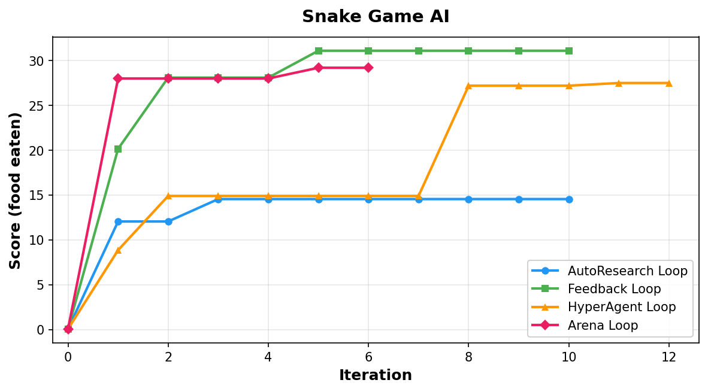
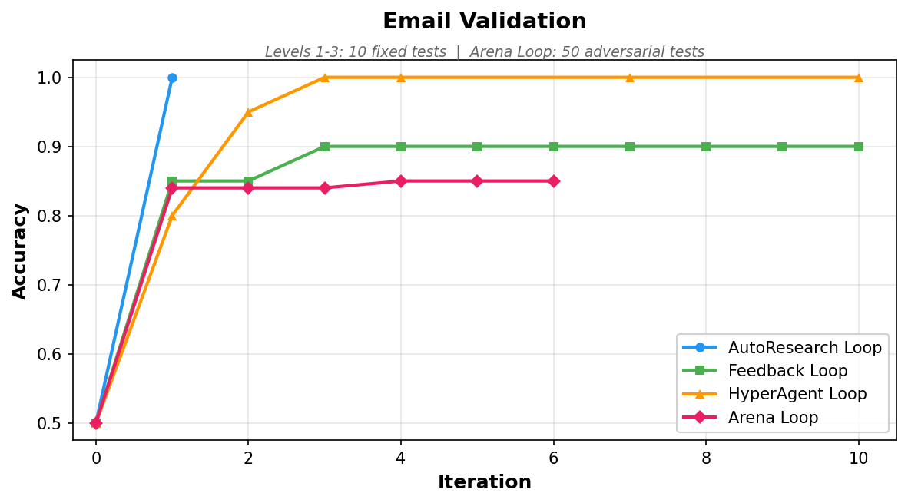
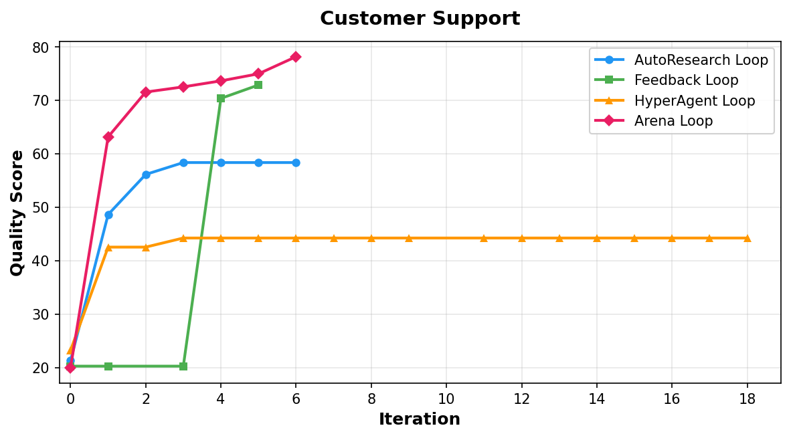

# Self-Improving Agents -- A Progression

Five levels of self-improving code agents, from the simplest loop to a full
adversarial arena with self-modifying agents. Each level adds one key idea.

Independent research comparing existing approaches to self-improving code agents
and proposing new ones.

## Results

| Snake Game AI | Email Validation |
|:---:|:---:|
|  |  |

| Customer Support |
|:---:|
|  |

---

- **Level 1 -- AutoResearch Loop:** LLM improves code against a benchmark (a la Karpathy's [AutoResearch](https://github.com/karpathy/autoresearch)).


- **Level 2 -- Feedback Loop:** A reviewer explains WHY it failed and suggests specific fixes (my contribution, built independently in Feb 2026 -- before AutoResearch and HyperAgents were published).


- **Level 3 -- HyperAgent Loop:** The agent rewrites its own source code (inspired by Meta's [HyperAgents](https://arxiv.org/abs/2603.19461)).


- **Level 4a -- Arena Single:** Pure adversarial co-evolution -- 1 code agent vs 1 test agent, no tournament (isolates the adversarial signal).

- **Level 4b -- Arena Loop:** Full arena with tournament selection -- 4 agents compete, worst replaced by mutated winners (adds population dynamics).


---

## Key Findings

- **Fixed benchmarks create false confidence** -- Levels 1-3 scored 90-100%
  on email validation's original tests, but dropped to 62-66% on Arena Loop's
  adversarial suite. Arena Loop held at 70%. The solutions that looked
  perfect were brittle.
- **Feedback Loop is the best cost-performance tradeoff** -- wins snake
  (31.1 vs Arena's 29.2), ties Arena on support (72.86 vs 69.86, within
  noise), but costs 20x less ($0.03 vs $0.63 per task)
- **Arena Loop builds robustness** -- scored 78.16 on support against 28
  adversarial questions (vs 10 original), climbing every round as the
  test suite grew. On the same 10 questions, Feedback Loop (72.86) and
  Arena Loop (69.86) are within scoring noise of each other.
- **Each level has its sweet spot** -- simple tasks need simple agents (Level 1),
  quality tasks need structured feedback (Level 2), and robustness against
  unseen edge cases needs adversarial testing (Level 4)

See [experiment-results.md](experiment-results.md) for full results and
cross-validation data.

---

## Setup

```bash
pip install -r requirements.txt
```

Create a `.env` file in the repo root:

```
GEMINI_API_KEY=your-api-key-from-https://aistudio.google.com/apikey
```

---

## Quick Start

```bash
# Run any level (default task: snake)
python autoresearch/run.py
python feedback-loop/run.py
python hyperagent/run.py
python arena-loop/run.py

# Different tasks
python autoresearch/run.py --task snake            # Snake game AI
python autoresearch/run.py --task support           # Customer support (LLM-as-judge)
python arena-loop/run.py --task email_validation    # Adversarial email validation

# Run experiments with logging and analysis
python autoresearch/experiment.py --task snake --iters 6

# Run ALL experiments across all levels + generate comparison analysis
python run_all.py

# Or pick specific levels/tasks
python run_all.py --levels hyperagent arena-loop --tasks snake
python run_all.py --fresh              # ignore previous results, start clean

# Cross-level comparison only (after experiments are done)
python analyze_results.py
```

All experiments support **checkpoint/resume** -- if interrupted, re-run the same
command and it picks up where it left off. Checkpoints are managed by the shared
`tasks/checkpoint.py` module with atomic writes.

---

## Watch the Snake AI Play

After running a snake experiment, you can watch the AI play in your terminal:

```bash
# Watch any level's best solution
python tasks/snake/play.py autoresearch/results/snake/solutions/best.py
python tasks/snake/play.py feedback-loop/results/snake/solutions/best.py
python tasks/snake/play.py hyperagent/results/snake/solutions/best.py
python tasks/snake/play.py arena-loop/results/snake/solutions/best.py

# Slower playback (default is 0.05s per step)
python tasks/snake/play.py arena-loop/results/snake/solutions/best.py --speed 0.1
```

---

## Level 1 -- `autoresearch/` -- AutoResearch Loop

The simplest self-improving loop. One agent, one task, one feedback signal.

```
LLM proposes code -> write to file -> run & benchmark -> keep if better -> repeat
```

This implements the **verifiable rewards** pattern from reinforcement learning
(AlphaGo, DeepSeek-R1 RLVR), applied at the agent level: the benchmark provides
a machine-checkable reward, enabling fully autonomous operation. Bad proposals
revert instantly -- rejection is free, only improvements accumulate.

---

## Level 2 -- `feedback-loop/` -- Feedback Loop

Adds a **reviewer agent** that explains WHY something failed.

Instead of just "rejected," the reviewer returns structured feedback:

```json
{
    "issue_type": "performance",
    "severity": "critical",
    "fix_suggestion": "First-element pivot is O(n^2) on reversed input. Use random pivot.",
    "confidence": 0.97,
    "pattern_detected": "persistent_regression"
}
```

The worker stays focused (small prompt, just the code). The reviewer sees
everything (full history, all previous feedback) and spots cross-iteration
patterns the worker would miss.

Key idea: **asymmetric information** -- match context size to role.

---

## Level 3 -- `hyperagent/` -- HyperAgent Loop

True **code-rewriting self-improvement**. The meta-agent doesn't just update a
text strategy -- it rewrites the actual source code of `task_agent.py` and
`meta_agent.py` (including its own code).

```
seed/              Original agent code (immutable reference)
agent_code/        Live working copies (rewritten by meta-agent)
generations/       Versioned snapshots (gen_000, gen_001, ...)
```

Two nested loops:
- **Inner loop**: `task_agent.py` proposes code improvements, benchmark, keep or revert
- **Outer loop**: `meta_agent.py` reads evaluation results and rewrites the agent source

A 3-stage crash recovery validates every rewrite before accepting it:
1. **Compile check** -- catches syntax errors
2. **Import check** -- catches missing dependencies, runtime init errors
3. **Signature check** -- ensures required functions still exist with correct parameters

Invalid rewrites revert to the last valid generation. Every generation is saved
to `generations/` with metadata for full traceability.

Inspired by Meta's DGM-H (HyperAgents, arxiv 2603.19461). Simplified: no Docker
containers, folder-based versioning instead.

---

## Level 4a -- `arena-loop/` -- Arena Single (1v1 adversarial)

Isolates the **adversarial co-evolution** mechanism: 1 code agent vs 1 test agent.
No tournament, no population dynamics -- just the arms race.

```
Round 1: Code agent reaches 100% accuracy.
         Test agent adds tricky edge cases.
         Score DROPS to 80%.
Round 2: Code agent adapts, recovers to 96%.
         Test agent finds new weaknesses.
         Score DROPS to 80% again.
Round 3: Code agent handles those too. 94%.
         Test agent keeps pushing. Repeat.
```

The arms race IS the training signal. Like GANs (Generative Adversarial
Networks) for code -- two agents push each other to improve.

Run with: `python arena-loop/experiment.py --code 1 --test 1 --label single`

---

## Level 4b -- `arena-loop/` -- Arena Loop (4-agent tournament)

Adds **tournament selection** on top of the adversarial mechanism. Multiple
code agents and test agents compete; worst are replaced by mutated winners
every K rounds. Strategies evolve through competition.

Code agents are mini-HyperAgents that can mutate their own `propose()` function
-- the code that generates code improvements is itself subject to evolution.

Resume is fully supported via serialize/deserialize on all agent objects.

Read `arena-loop/CONCEPT.md` for the full architectural writeup.

---

## Tasks

Tasks live in the shared `tasks/` folder. Each is a folder with real runnable files:

| Task | Type | Best showcase |
|------|------|---------------|
| `snake` | Deterministic (score) | All levels (gradual improvement) |
| `support` | LLM-as-judge (quality) | Levels 2-3 (structured feedback shines) |
| `email_validation` | Adversarial (accuracy) | Level 4 (arms race proves robustness) |

### Adding Your Own Task

The framework is task-agnostic. To add a new task, create a folder in `tasks/` with three files:

```
tasks/your_task/
  config.py            # TASK_NAME, METRIC_NAME, HIGHER_IS_BETTER, PROMPT_TEMPLATE, build_prompt()
  initial_solution.py  # Starting code (the baseline the agents will improve)
  benchmark.py         # Runs the solution, prints "metric_name:value" to stdout
```

**config.py** defines what the task is and how to prompt the LLM:
```python
TASK_NAME = "your_task"
METRIC_NAME = "score"          # what the benchmark prints
HIGHER_IS_BETTER = True        # True = maximize, False = minimize
PERFECT_SCORE = 100.0          # optional: stop early when reached

def build_prompt(code, metric):
    return f"Improve this code. Current {METRIC_NAME}: {metric}\n\n{code}"
```

**benchmark.py** runs the solution and prints the metric:
```python
# Usage: python benchmark.py <solution_file>
# Must print: score:42.5  (or whatever METRIC_NAME is)
```

Then run any level with `--task your_task`:
```bash
python autoresearch/run.py --task your_task
python run_all.py --tasks your_task
```

For LLM-as-judge tasks (subjective quality), set `USES_LLM_JUDGE = True` in config.py
and have benchmark.py print `answers:` JSON instead of a metric. For more stable scoring,
generate a boolean rubric:

```bash
python tasks/generate_rubric.py --task your_task
```

This analyzes your test cases and knowledge base, then generates `rubric_checks.json`
(per-question boolean fact checks with weights) and `rubric.py` (scoring engine).
Review the generated checks, add `USES_RUBRIC = True` to config.py, and run your
experiment. See `tasks/support/` for an example.

---

## File Structure

```
tasks/                      Shared task definitions
  snake/                      initial_solution.py, benchmark.py, config.py, play.py
  support/                    initial_solution.py, benchmark.py, config.py, ...
  email_validation/           initial_solution.py, benchmark.py, config.py, ...
  task_runner.py              Central: load_task, write_solution, run_solution
  checkpoint.py               Shared checkpoint/resume (atomic writes, all levels)

autoresearch/               Level 1: AutoResearch Loop
  run.py, llm.py, experiment.py

feedback-loop/              Level 2: Feedback Loop
  run.py, worker.py, reviewer.py, llm.py, experiment.py

hyperagent/                 Level 3: HyperAgent Loop
  run.py, llm.py, experiment.py
  seed/                       Original agent code (immutable)
    task_agent.py               Seed task agent
    meta_agent.py               Seed meta-agent
  agent_code/                 Live working copies (rewritten each generation)
  generations/                Versioned snapshots (gen_000/, gen_001/, ...)

arena-loop/                 Level 4: Arena Loop
  run.py, code_agent.py, test_agent.py, arena.py, llm.py, experiment.py, CONCEPT.md

run_all.py                  Run all experiments + generate analysis (single command)
analyze_results.py          Cross-level comparison of experiment results
```

---

## Checkpoint & Resume

All levels use a shared checkpoint module (`tasks/checkpoint.py`) for
atomic, resumable checkpointing. If an experiment is interrupted (crash, API
timeout, Ctrl+C), re-run the same command and it resumes from the last
checkpoint. Checkpoints are sequence-numbered JSON files with atomic writes
(write to .tmp, then os.replace). Only the last 3 checkpoints are kept.

---

## Background & Prior Work

See [PRIOR_WORK.md](PRIOR_WORK.md) for the full context: verifiable rewards lineage
(AlphaGo, RLVR, AutoResearch), independent convergence across groups in early 2026,
and how this project's adversarial approach differs from prior code/test co-evolution work.

---

## Key Ideas

| Level | Adds | Key insight | Lineage |
|-------|------|-------------|---------|
| 1 | The loop | Rejection is free. Only improvements accumulate. | Verifiable rewards (AlphaGo, RLVR) |
| 2 | Structured feedback | Know WHY it failed, not just that it failed. | Asymmetric context windows |
| 3 | Code-rewriting | The agent rewrites its own source code. | Meta's HyperAgents (DGM-H) |
| 4 | Adversarial co-evolution | A fixed benchmark gets gamed. An evolving benchmark doesn't. | GANs, co-evolutionary algorithms |
